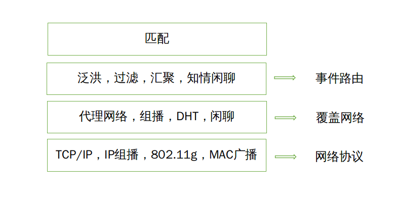

### 分布式系统学习摘要
##### 分布式系统的几个显著特点
1. 并发执行
2. 无全局的时钟
3. 故障的独立性-无法辨别机器故障还是网络故障，也就得保障故障时的依旧可运行

##### 超级复杂的分布式系统
- Web搜索
  - 一个底层的物理设施
  - 一个分布式的文件系统
  - 一个相关的结构化分布式存储系统
  - 一个锁系统
  - 一个编程模式
- 大型在线游戏（MMOG）
  - 客户-服务器模型（负载分区和用户分区） EVE游戏
  - 完全对等的技术？研究中 => 长久运行（永不宕机）的游戏服务基础设施
- 金融交易
  - 基于事件的分布式系统
  - 异构性问题的适配器。复杂事件处理(CEP)

##### 趋势
1. 出现了泛在联网技术
2. 出现了无处不在计算，支持用户移动性的意愿
3. 对多媒体设备的需求增加
4. 把分布式系统作为一个基础设施 （云计算，云存储等）

##### 挑战
1. 异构性（网络，计算机硬件，操作系统，编程语言，软件实现等），通过中间件实现
2. 开放性
   - 发布系统的关键接口是开发系统的特征
   - 开发的分布式系统是基于一致的通信机制和发布接口访问共享资源
   - 能够使用异构的硬件和软件构建
3. 安全性。有两大安全：DDOS, 移动代码的安全性(远程代码的本地执行)
   - 机密性
   - 完整性
   - 可用性
4. 可伸缩性 —— 理想状态下，系统规模变化时候，系统和应用程序应该不需要随之改变
   - 控制物理资源的开销
   - 控制性能损失
   - 防止软件资源耗尽
   - 避免性能瓶颈
5. 故障处理
   - 检测故障
   - 掩盖故障
   - 容错
   - 故障恢复
   - 冗余 —— 以便解决容错
6. 并发性
7. 透明性 —— 对外屏蔽分布式系统的分离性，被认为是一个整体
   - *访问透明性*
   - *位置透明性*
   - 并发透明性
   - 复制透明性
   - 故障透明性
   - 移动透明性
   - 性能透明性
   - 伸缩透明性
8. 服务质量 —— 可靠，安全，性能

#### 分布式体系结构
##### 体系结构元素
- 通信实体：
  - 对象
  - 组件
  - Web服务
- 通信范型：
  - 进程间通信
    - 消息传递
    - 套接字
    - 多播
  - 远程调用
    - 请求-应答模型
    - 远程过程调用-RPC
    - 远程方法调用-RMI（一般跟分布式对象一起组合使用）
  - 间接通信
    - 组通信（一对多的通信范型）
    - 发布-订阅系统
    - 消息队列（生产者和消费者模型的中介方式）
    - 元组空间（生成通信，提供一个持久的元组空间）
    - 分布式共享内存（DSM）
- 角色和责任
  - 客户 —— 服务器
  - 对等体系结构
##### 体系结构模式
- 分层体系结构（Layering architecture）
- 层次化体系结构（tiered architecture）
- 瘦客户相关的概念（包括虚拟网络计算的特定机制）
#### 基础模型
- 交互模型
  - 通信信道的性能：延迟(latency), 带宽(bandwidth), 抖动(jitter, 多与流媒体相关)
  - 计算机时钟和时序事件：时钟漂移率(clock drift rate)
  - 交互模型的两个变体
    - 同步分布式系统：进程执行的每一步的时间都有一个上限和下限，通过通道传递的每一个消息在一个已知的范围内接收到，每个进程有一个本地时钟，与实际事件的漂移率在一个已知的范围
    - 异步分布式系统：进程执行速度不受限制，消息传递延迟不受限制，时钟漂移率不受限制
  - 事件排序（Pepperland协定）—— 逻辑时间
- 故障模型
  - 遗漏故障 —— 良性故障：进程或者通信通道不能完成它应该做的动作。进程遗漏故障主要是崩溃。通信遗漏故障（发送,通道,接收遗漏故障）
  - 随机故障（拜占庭故障）—— 恶性故障
  - 时序故障（同步分布式系统中，性能故障） —— 良性故障：实时操作系统
  - 故障屏蔽
  - 一对一通信的可靠性：有效性与完整性（重放攻击，伪造消息，篡改消息）
- 安全模型
  - 保护对象
  - 保护进程与它们的交互
  - 解除安全威胁
    - *密码学与共享秘密*
    - *认证*
    - *安全通道*：每个进程知道执行主体身份，保障传输数据的私密性和完整性，消息包括物理或逻辑时间戳防止重放和篡改
  - 其他可能的来自敌人的威胁（拒绝服务攻击，移动代码执行等）

### 网络与网络互联
### 进程间通信
层次： 2和3都是中间件层
1. 应用，服务
2. 远程调用和间接通信
3. 底层进程间通信原语：套接字，消息传递，组播支持，覆盖网络
4. UDP和TCP

- UDP：提供了消息传递(message passing)抽象
- TCP：提供了进程间的双向数据流(two-way stream)抽象 —— 生产者和消费者

- CORBA：公共数据表示(Common Data Representation)

#### 组播通信
将单个消息从一个进程发送到一组进程的每一个成员。

组播通信为构造下面特征的分布式系统提供了基础设施:
- 基于复制服务的容错(fault tolerance based on replicated services), 就是客户需要发送消息到一组服务器所有成员上，这样，就算每个宕机，也可以提供服务
- 在自发网络中发现服务(discovering services in spontaneous networking)
- 通过复制的数据获得更好的性能(better performance through replicated data)
- 事件通知的传播(propagation of event notification) —— 发布订阅
##### IP组播 —— 组播通信的实现
- 组播路由器 —— 设置路由长度：存活时间(TTL)
- 组播地址分配 —— 224.0.0.0 ~ 239.255.255.255

#### 覆盖网络 overlay network
是一个节点与虚拟链接组成的虚拟网络，位于一个底层网络（例如IP网络）之上。

- 为应用需求而裁剪
  - 分布式散列表 —— Kad
  - 对等文件共享 —— BT下载
  - 内容分发网络 —— CDN
- 为网络类型而裁剪
  - 无线自组织网络 —— 提供的定制的路由协议，包括能在底层节点上有效构造路由拓扑的主动模式和按需构建路由的被动模式，后者通常由泛洪机制支持
  - 容中断网络 —— 用于恶劣环境中，可能遭遇严重链接故障，具有很高的延迟
- 提供额外的特性
  - 组播
  - 恢复能力 —— 提升互联网服务路径健壮性和可用性
  - 安全性 —— 虚拟私网
- 实例研究 —— Skype

### 远程调用
##### RPC
- RPC推动的编程风格——面向接口编程
- 和RPC关联的调用语义
- 透明性的关键问题和它如何与远程过程调用相关联
- 分布式系统的接口与接口定义语言(Interface Definition Languages)
- RPC调用语义
  - 重发请求消息，过滤重复请求，重传结果
  - 或许调用语义——可能调用执行一次或者根本不执行
  - 至少调用一次语义
  - 至多一次调用语义
- 实例 Sun RPC —— Sun NFS

##### RMI
- 与RPC共性
  - 接口编程
  - 基于请求——应答模型
  - 相似地透明度
- 不同点
  - 可以使用面向对象的方式
  - 基于面向对象中对象标识的概念（对象具有惟一的标识符）
- 两个核心的概念
  - 远程对象的引用 —— 能够调用远程的对象去调用别的远程对象
  - 远程接口
- 实例研究 —— Java RMI

### 间接通信
|  | 时间耦合 | 时间解耦 |
| --- | --- | --- |
| 空间耦合 | 性质：与一个或一些给定的接收者直接通信；接收者必须在那个时候存在 例子：消息传递，远程调用 | 性质：与一个或一些给定的接收者直接通信；发送者和接收者有各自的独立的生命周期 |
| 空间解耦 | 性质：发送者不需要知道接收者的身份；接收者必须在那个时候存在 例子：IP组播 | 性质：发送者不需要知道接收者的身份；发送者和接收者有各自的独立的生命周期 例子：大部分间接通信模型 |

- 组通信。组通信对于IP组播就像TCP对IP中的点对点服务一样。
  - 应用领域：
    - 面向可能是大量客户的可靠信息分发，包括金融业
    - 支持协作应用 google docs
    - 支持一系列容错策略，包括复制数据的一致更新，或者高可用（复制）服务器实现
    - 支持系统监控和管理，包括负载均衡策略
  - 编程模型：一个进程事项只发起一个组播操作，是一个send操作，将消息传到组的每一个成员，而不是发起多个send操作
    - 进程组和对象组
    - 封闭组和开发组：封闭组只发送到本组内，开发组可以发送到任何人那
    - 重叠和非重叠组：在实际系统中，组成员的重叠是现实的
    - 同步和异步系统
  - 实例研究 —— JGroups工具箱
- 发布-订阅系统(publish-subscribe systems)。有时也被称为基于事件的分布式系统(distributed event-based system)。大部分系统都是自然地建模成由事件提供的更为解耦和反应式的编程风格。
  - 应用场景：
    - 金融信息系统
    - 实时数据直接输入的其他领域(RSS)
    - 支持协同工作
    - 支持无处不在的计算，包括管理来自无处不在基础设施的事件（例如：位置事件）
    - 一系列监控应用，包括互联网上的网络监控
  - 特征：
    - 异构性
    - 异步性
    - 传递保障
  - 实现方式
    - 集中式实现：单点服务器提供代理，缺乏弹性和可伸缩性
    - 分布式实现：代理网络(network of broker)

    

    - 泛洪：像网络中所有节点发送事件通知，不必要的网络流量
    - 过滤：基于本地和代理点的路由订阅信息，单独给订阅者发送，但是订阅者需要事先向可能的发布者泛洪告知
    - 汇聚：类DHT一样的路由机制
    - 知情闲聊(informed gossip)：将动态消息与邻居进行交换
  - 实例研究：

  | 系统               | 订阅模型       | 分布模型  | 事件路由   |
  | ---                | ---            | ---       | ---        |
  | CORBA 事件服务     | 基于渠道       | 集中式    |            |
  | TIB Rendezvouz     | 基于主题       | 分布式    | 过滤       |
  | Scribe             | 基于主题       | 对等(DHT) | 汇聚       |
  | TERA               | 基于主题       | 对等      | 知情闲聊   |
  | Siena              | 基于内容       | 分布式    | 过滤       |
  | Gryphon            | 基于内容       | 分布式    | 过滤       |
  | Hermes             | 基于主题和内容 | 分布式    | 汇聚和过滤 |
  | MEDYM              | 基于内容       | 分布式    | 泛洪       |
  | Meghdoot           | 基于内容       | 对等      | 汇聚       |
  | Structure-less CBR | 基于内容       | 对等      | 知情闲聊   |

- 消息队列 —— 分布式消息队列 —— 面向消息的中间件
  - 集中式实现
  - 分布式实现：WebSphere MQ, JMS
- 共享内存
  - 分布式共享内存（DSM） —— 必须是异步，不再是基于请求-应答模型
  - 元组空间通信 —— 生成通信。Agora系统，JavaSpaces, TSpaces
    - 空间解耦 —— 分布式命名(distributed naming)
    - 事件解耦

|          | 组             | 发布-订阅系统                     | 消息队列                    | DSM              | 元组空间                             |
| ---      | ---            | ---                               | ---                         | ---              | ---                                  |
| 空间解耦 | 是             | 是                                | 是                          | 是               | 是                                   |
| 时间解耦 | 可能           | 可能                              | 是                          | 是               | 是                                   |
| 服务风格 | 基于通信       | 基于通信                          | 基于通信                    | 基于状态         | 基于状态                             |
| 通信模式 | 一对多         | 一对多                            | 一对一                      | 一对多           | 一对一或一对多                       |
| 主要目的 | 可靠分布式计算 | 信息分发或EAI；移动和无处不在系统 | 信息分发或EAI；商业事务处理 | 并行和分布式计算 | 并行和分布式计算；移动和无处不在系统 |
| 可伸缩性 | 有限           | 可能                              | 可能                        | 有限             | 有限                                 |
| 关联性   | 无             | 仅基于内容的                      | 无                          | 无               | 有                                   |

### 操作系统支持
